# django_botiga
DOCUMENTACIO

- CATALOG:
    - Model del product amb 10 items inicials: 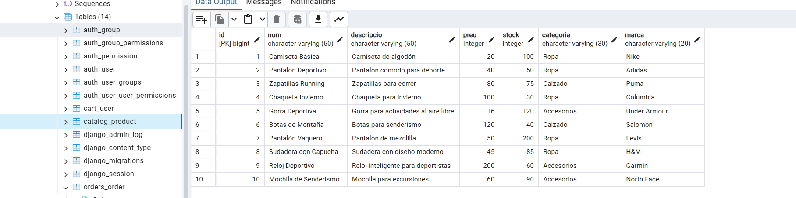

- CRUD:
    - GET: 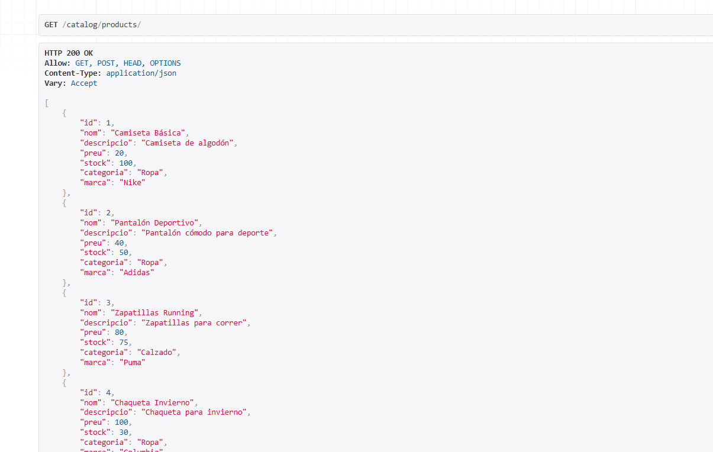
    - POST: 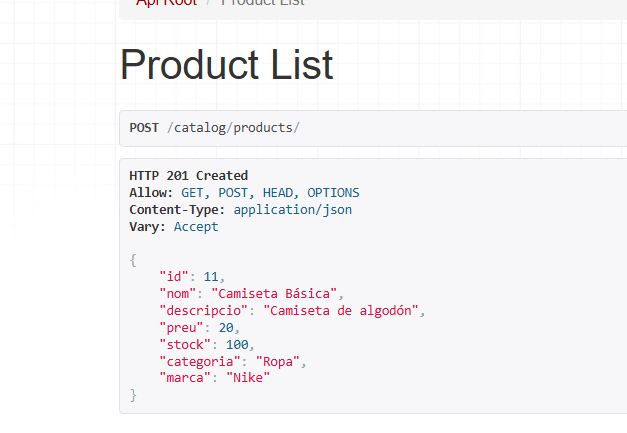
    - PUT: 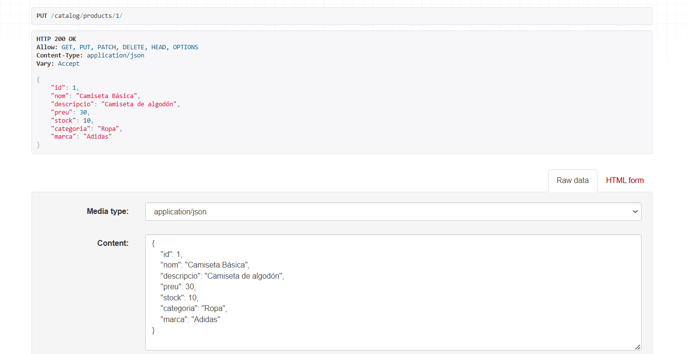
    - DELETE: 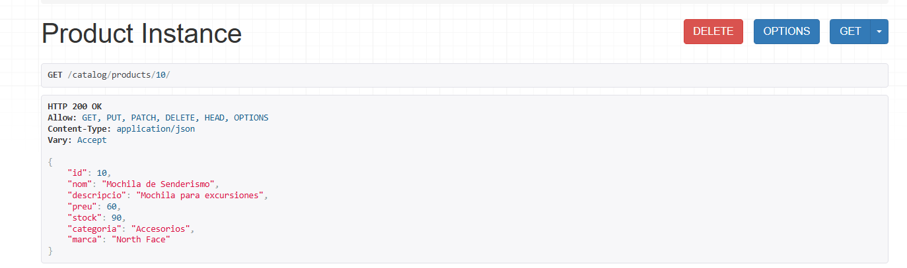 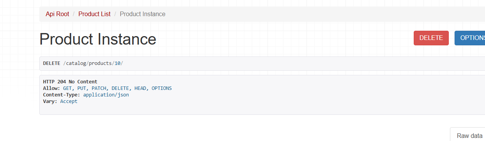

- PAYMENT

    - MODEL: 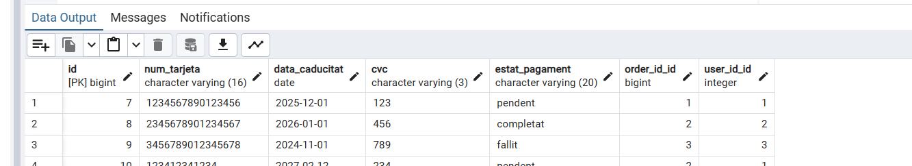

    - La verificació de les dades de pagament es fa amb el metode verifcar_tarjeta a payment/views.py. Verifica que el num de la tarjeta sigui de 16 dígits, qul el cvc sigui de 3, i que la tarjeta no estigui caducada.
    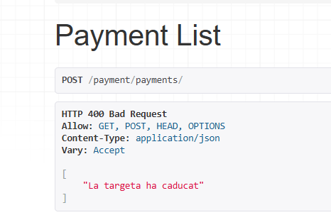
    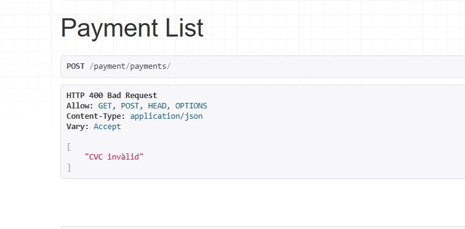
    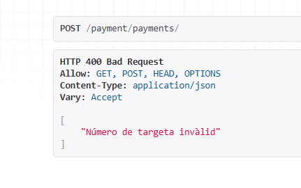

    - Verificació User: 
        - Només es pot afegir un payment a un usuari existent a la bbdd. 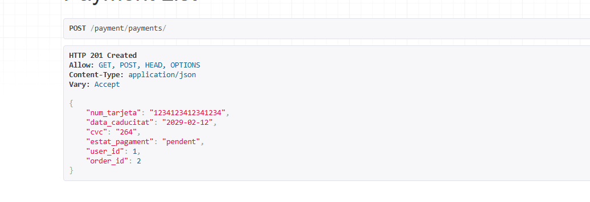
        
        - Si no és existent: 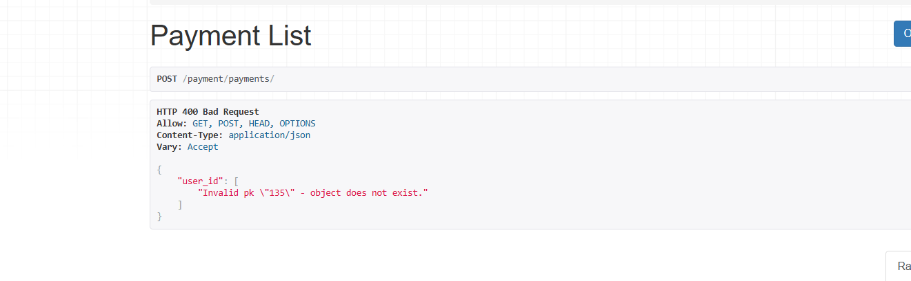

    - Enllaç amb order:
        - Si l'estat de pagament és completat, l'estat de l'order enllaçada al pagament per l'id canvia a completat també.
            - L'ordre 2 està en pendent: 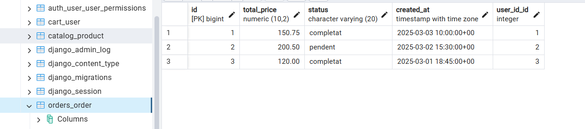

            - Si el pagament que estigui assossiat a l'ordre 2 es completa, l'esta s'actualitza: 
            https://drive.google.com/file/d/1vo0SGzvhn1ePPSvnRp_C_42fBV45EA3Z/view?usp=sharing
